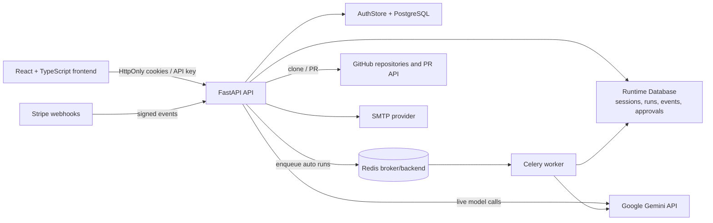
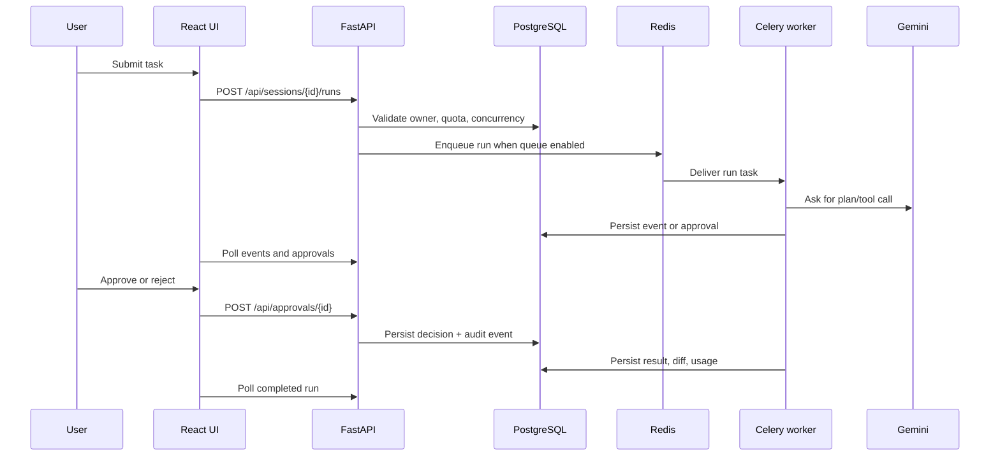

# RepoPilot Architecture

## Product boundary

RepoPilot is a multi-tenant AI developer workspace. A user connects a public GitHub repository or selects a built-in demo, describes a change, and observes an agent workflow that can search, read, edit, test, diff, and prepare a pull request. Every consequential edit and test command remains behind an approval gate.

The application has two supported modes:

- **Demo mode**: `AUTH_REQUIRED=false`; anonymous HttpOnly ownership cookies keep the original local/demo workflow available.
- **SaaS mode**: `AUTH_REQUIRED=true`; PostgreSQL-backed users own sessions, runs, approvals, usage, teams, and audit records through authenticated IDs.

## System context



## Runtime components

### Frontend

Source lives in `frontend-react/` and is built with Vite, React, TypeScript, Tailwind CSS, and lucide icons. The production build is emitted to `frontend-react/dist/`. `backend/app/config.py` selects that directory when it exists and falls back to the legacy `frontend/` directory in an unbuilt checkout.

The React application contains:

- centered login/signup screen with Google and GitHub OAuth links;
- responsive left workspace/history sidebar;
- repository and demo entry points;
- conversation-style agent timeline;
- inline approval cards with approve/reject actions and previews;
- loading, error, empty, toast, and dark-theme states;
- authenticated account and plan display.

### FastAPI API

`backend/app/main.py` owns HTTP routing, authentication middleware, ownership checks, configuration, health, usage, billing, and static frontend delivery.

The ownership seam is intentionally preserved:

```text
request.state.owner
        |
        +-- demo mode: 128-bit anonymous cookie
        |
        +-- SaaS mode: authenticated users.id
        +-- programmatic mode: API key -> users.id
```

Existing session, run, approval, diff, patch, and PR routes continue to use this seam, so the agent and guardrail contracts do not need to know how a user authenticated.

### Agent and guardrails

`backend/app/agent.py` remains provider-neutral. `backend/app/runner.py` owns run lifecycle and workspace execution. `backend/app/tools.py` and `backend/app/guardrails.py` continue to enforce:

- repository path containment;
- secret and credential file blocking;
- allowed test-command execution;
- edit/test approval policy;
- per-run file, line, step, token, cost, and timeout limits.

Approval decisions are persisted in `approvals`, emitted as run events, and written to `audit_logs` for authenticated users.

### Persistence

There are two database layers with a shared user identity:

1. `AuthStore` uses SQLAlchemy and PostgreSQL in SaaS mode for identity, OAuth identities, refresh tokens, email tokens, teams, usage, audit logs, and API keys.
2. `Database` stores runtime sessions, runs, events, and approvals. It uses PostgreSQL when `DATABASE_URL` is a PostgreSQL URL and SQLite only for local/test compatibility.

Alembic migrations are in `backend/alembic/versions/`:

- `0001_auth_billing.py`: identity, tenancy, tokens, usage, audit, and API-key tables;
- `0002_runtime_tables.py`: sessions, runs, events, and approvals.

The application also uses idempotent runtime table creation for local compatibility. Production startup should always run `alembic upgrade head` first.

### Background jobs

When `QUEUE_ENABLED=true` and an automatic run is requested, `Runner` submits `repopilot.run_agent` to Celery. Redis carries the task and result messages. The worker reconstructs the runtime database and runner, then executes the same agent/guardrail path.

Approval state is durable. A worker waiting at an approval gate periodically checks the database, so an approval recorded by a separate web process can release the worker.

## Authentication model

### Email/password

1. `POST /api/auth/signup` creates a PBKDF2 password hash and one-time verification token.
2. If SMTP is configured, the token is sent by email. If SMTP is not configured, local development receives the token in the response.
3. `POST /api/auth/verify` marks the email verified.
4. `POST /api/auth/login` issues a short-lived `rp_access` HttpOnly cookie and rotates a `rp_refresh` HttpOnly cookie.
5. `POST /api/auth/refresh` rotates the refresh token and issues a new access token.
6. `POST /api/auth/logout` revokes the refresh token and clears both cookies.

Access tokens are signed JWTs. Passwords, raw refresh tokens, email tokens, and API keys are never stored in plaintext.

### OAuth

OAuth start routes are:

- `/api/auth/oauth/google`
- `/api/auth/oauth/github`

Callbacks are:

- `/api/auth/oauth/google/callback`
- `/api/auth/oauth/github/callback`

The flow uses a short-lived state cookie, exchanges the code server-side, links identities by provider subject, and marks OAuth email addresses verified.

### API keys

Authenticated users may create a one-time-display API key with `POST /api/auth/api-keys`. CI clients send it using `X-API-Key`. Only a SHA-256 hash is persisted.

## Tenant and quota model

The current tenant foundation includes:

- `users` with `free` or `paid` plan;
- `teams` and `team_members` with `owner` and `member` roles;
- session/run ownership by `users.id` in SaaS mode;
- `usage_ledger` for monthly run counts and estimated cost;
- free and paid monthly limits;
- free and paid concurrent-run limits;
- `/api/usage` dashboard endpoint.

Stripe subscription events update `users.plan`. The webhook is signed with `STRIPE_WEBHOOK_SECRET` and must be exposed at `/api/billing/webhook`.

## Security boundaries

- Gemini keys remain server-side and are redacted from errors/events.
- Cookies are HttpOnly and use `Secure` automatically when `APP_BASE_URL` is HTTPS.
- OAuth uses a state cookie to prevent callback forgery.
- API keys are hashed before storage.
- Runtime ownership checks return indistinguishable 404 responses for missing or foreign resources.
- Public mode disables arbitrary repository test execution; built-in demos remain executable.
- HTTPS, secret rotation, SMTP provider security, PostgreSQL backups, Redis authentication, and a real sandbox for untrusted test execution remain deployment responsibilities.

## Request flows

### Authenticated live run



## Deployment topology

### Local demo

```text
python run.py
  -> FastAPI
  -> SQLite runtime database
  -> anonymous cookie ownership
  -> optional Gemini
```

### Local authenticated profile

```text
AUTH_REQUIRED=true
DATABASE_URL=sqlite:///...  # auth-store development convenience
AUTH_AUTO_CREATE=true
JWT_SECRET=...
  -> FastAPI
  -> SQLAlchemy auth database
  -> SQLite runtime fallback
```

### Production / Render

`render.yaml` defines:

- a Docker web service;
- a Docker Celery worker;
- a managed Redis instance;
- a managed PostgreSQL database.

The web container runs `alembic upgrade head` before `python run.py`. Set the same `JWT_SECRET` on web and worker, use an HTTPS `APP_BASE_URL`, and provide all provider secrets through the Render dashboard.
